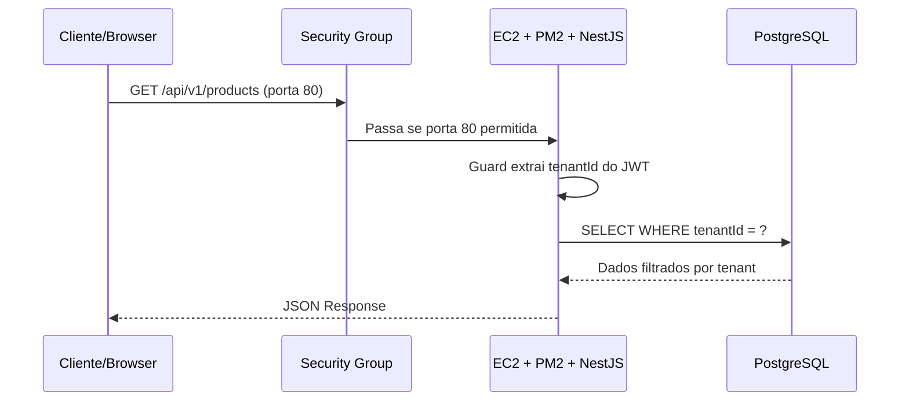

# 🍪 Prática EC2 — Deploy IaaS do Cookie Factory (NestJS)

## Guia Completo para Alunos e Professor

> [!NOTE]
> **Duração:** 30 minutos | **Nível:** Intermediário | **Pré-requisito:** Conta AWS Free Tier ativa

---

## 📋 Índice

1. [Visão Geral do Projeto](#1-visão-geral-do-projeto)
2. [Análise da Arquitetura](#2-análise-da-arquitetura)
3. [Mapa de Componentes do Repositório](#3-mapa-de-componentes)
4. [Checklist Pré-Prática (Professor)](#4-checklist-pré-prática)
5. [Passo 1 — Lançamento do Monolito Modular (10 min)](#5-passo-1)
6. [Passo 2 — Validando as Muralhas Digitais (10 min)](#6-passo-2)
7. [Passo 3 — Auditoria do Porteiro via SSH (10 min)](#7-passo-3)
8. [O Script User Data — Linha a Linha](#8-script-user-data)
9. [Conceitos-Chave: PaaS vs IaaS](#9-paas-vs-iaas)
10. [Troubleshooting](#10-troubleshooting)
11. [Exercícios Extras](#11-exercícios-extras)

---

## 1. Visão Geral do Projeto

O **Cookie Factory** (codinome `mb-supply-hub`) é um sistema SaaS Multi-tenant de gestão de estoque construído como **Monolito Modular**.

### Stack Tecnológica

| Camada | Tecnologia | Versão |
|--------|-----------|--------|
| Runtime | Node.js | v20 LTS |
| Framework | NestJS | v10/v11 |
| Linguagem | TypeScript | v5.6+ |
| ORM | Prisma | v5.20 |
| Banco de Dados | PostgreSQL | 16 |
| Testes | Jest + Supertest | v29 |
| Process Manager | PM2 | latest |

### O que é Multi-Tenancy?

```
┌─────────────────────────────────────────────────┐
│              Cookie Factory API                  │
│                                                  │
│  Requisição HTTP → JWT Token → tenantId extraído │
│                                                  │
│  ┌──────────┐  ┌──────────┐  ┌──────────┐      │
│  │ Tenant A │  │ Tenant B │  │ Tenant C │      │
│  │ (Loja 1) │  │ (Loja 2) │  │ (Loja 3) │      │
│  │ Produtos │  │ Produtos │  │ Produtos │      │
│  │ Estoque  │  │ Estoque  │  │ Estoque  │      │
│  └──────────┘  └──────────┘  └──────────┘      │
│       ↓              ↓              ↓            │
│  ┌──────────────────────────────────────────┐   │
│  │  PostgreSQL (isolamento por tenantId)    │   │
│  └──────────────────────────────────────────┘   │
└─────────────────────────────────────────────────┘
```

Cada requisição carrega um JWT com o `tenantId`. O sistema **nunca** permite que o Tenant A veja dados do Tenant B.

---

## 2. Análise da Arquitetura

### Estrutura do Monolito Modular

```
mb-supply-hub/
├── backend/                    ← Aplicação NestJS principal
│   ├── prisma/
│   │   ├── schema.prisma       ← Modelos do banco (Tenant, etc.)
│   │   └── migrations/         ← Histórico de migrações SQL
│   ├── src/
│   │   ├── main.ts             ← Entry point (escuta na PORT)
│   │   ├── app.module.ts       ← Registro de todos os módulos
│   │   ├── config/             ← Validação de variáveis de ambiente
│   │   ├── database/           ← PrismaService (conexão ao banco)
│   │   ├── common/             ← Guards, Filters, Decorators
│   │   └── modules/            ← 👇 Domínios de negócio
│   │       ├── tenants/        ← Gestão de Inquilinos
│   │       ├── auth/           ← Autenticação JWT
│   │       ├── users/          ← Gestão de Usuários
│   │       ├── permissions/    ← RBAC
│   │       ├── products/       ← Catálogo de Produtos
│   │       ├── suppliers/      ← Fornecedores
│   │       ├── materials/      ← Estoque e Movimentações
│   │       ├── reports/        ← Relatórios Operacionais
│   │       └── health/         ← Health Check
│   └── package.json            ← Scripts: build, start:prod, prisma
├── src/middlewares/
│   └── authMiddleware.js       ← Middleware de extração do tenantId
├── tests/
│   └── security.test.js        ← Teste de isolamento multi-tenant
├── scripts/
│   └── ec2-user-data.sh        ← 🆕 Script User Data desta prática
├── docker-compose.yml          ← PostgreSQL para dev local
├── .env.example                ← Template de variáveis de ambiente
└── Procfile                    ← Definição de processo (PaaS)
```

### Fluxo de uma Requisição



---

## 3. Mapa de Componentes

### Módulos NestJS

| Módulo | Responsabilidade |
|--------|-----------------|
| **Tenants** | Cadastro e gestão de empresas/organizações |
| **Auth** | Login JWT com `tenantId` no payload |
| **Users** | CRUD de usuários vinculados a tenants |
| **Permissions** | Roles e permissões por tenant (RBAC) |
| **Products** | Catálogo de produtos por tenant |
| **Suppliers** | Fornecedores por tenant |
| **Materials** | Estoque, movimentações (IN/OUT/ADJUSTMENT) |
| **Reports** | Relatórios (estoque baixo, movimentações) |
| **Health** | Endpoint de saúde `/api/v1/health` |

### Prisma Schema — Modelo Tenant

```prisma
model Tenant {
  id        Int          @id @default(autoincrement())
  name      String
  cnpj      String       @unique
  address   String
  status    TenantStatus @default(ACTIVE)
  createdAt DateTime     @default(now())
  updatedAt DateTime     @updatedAt
}
```

### Validação de Variáveis de Ambiente

O sistema exige na inicialização:

| Variável | Tipo | Obrigatória |
|----------|------|-------------|
| `DATABASE_URL` | URI postgresql:// | ✅ Sim |
| `JWT_SECRET` | string (mín. 8 chars) | ✅ Sim |
| `JWT_EXPIRES_IN` | string (ex: "1d") | ✅ Sim |
| `NODE_ENV` | development/test/production | Não (default: development) |
| `PORT` | número | Não (default: 3000) |

> [!IMPORTANT]
> Se qualquer variável obrigatória estiver faltando no `.env`, o NestJS **não inicia**.

---

## 4. Checklist Pré-Prática

> [!CAUTION]
> O professor deve verificar **todos** os itens antes da aula ao vivo.

- [ ] Conta AWS com acesso ao EC2 (Free Tier habilitado)
- [ ] Key Pair (.pem) criado na região escolhida
- [ ] Repositório público: `https://github.com/marcio-loiola/-mb-supply-hub.git`
- [ ] `schema.prisma` lê `DATABASE_URL` do ambiente → ✅ Confirmado
- [ ] `package.json` tem script `"build": "nest build"` → ✅ Confirmado
- [ ] `package.json` tem script `"start:prod": "node dist/main"` → ✅ Confirmado
- [ ] `main.ts` respeita variável `PORT` → ✅ Confirmado
- [ ] Health endpoint em `/api/v1/health` → ✅ Confirmado
- [ ] Postman ou browser pronto para testes
- [ ] Script `ec2-user-data.sh` revisado

---

## 5. Passo 1 — Lançamento do Monolito Modular (10 min)

### 5.1 Configuração da Instância EC2

1. Acesse **AWS Console → EC2 → Launch Instance**

| Campo | Valor |
|-------|-------|
| Name | `cookie-factory-nestjs` |
| AMI | Ubuntu Server 24.04 LTS |
| Instance type | `t2.micro` (Free tier) |
| Key pair | Sua chave `.pem` |

### 5.2 Security Group

Crie regras de **Inbound**:

| Tipo | Porta | Origem | Finalidade |
|------|-------|--------|------------|
| SSH | 22 | Meu IP | Gerência remota |
| HTTP | 80 | 0.0.0.0/0 | Acesso público à API |

> [!WARNING]
> **Nunca** libere a porta 22 para `0.0.0.0/0` em produção!

### 5.3 User Data

1. Expanda **Advanced details**
2. Cole o conteúdo de `scripts/ec2-user-data.sh`
3. Clique em **Launch Instance**

> 🎤 *"Reparem no README do nosso projeto. Toda aquela estrutura complexa de domínios — Gestão de Inquilinos, RBAC, Estoque e Relatórios — está sendo compilada e o Prisma está gerando as tabelas no banco agora mesmo, sem que eu tenha digitado uma linha de terminal."*

---

## 6. Passo 2 — Validando as Muralhas Digitais (10 min)

### 6.1 Primeiro Acesso

Copie o IP Público e envie no chat: `http://<IP>/api/v1/health`

Resposta esperada:
```json
{
  "data": {
    "service": "backend",
    "status": "ok",
    "timestamp": "2026-05-19T19:42:00.000Z"
  },
  "message": "Health check completed successfully"
}
```

### 6.2 Desafio — Bloqueio pelo Security Group

1. Vá em **Security Groups → Edit inbound rules**
2. **Remova** a regra da porta 80 → Salve
3. Peça para atualizarem a página (vai travar!)

> 🎤 *"O Security Group bloqueou o acesso à camada de aplicação. A API continua rodando dentro da VM — o PM2 nem percebeu. O que mudou foi a muralha de rede. Isso é proteção de infraestrutura em IaaS."*

4. **Restaure** a regra da porta 80

```
ANTES:  Browser → [SG: ✅ porta 80] → EC2 → NestJS → Resposta
DEPOIS: Browser → [SG: ❌ porta 80] → TIMEOUT (EC2 continua rodando!)
```

---

## 7. Passo 3 — Auditoria do Porteiro via SSH (10 min)

### 7.1 Conexão

```bash
chmod 400 sua-chave-cookie-factory.pem
ssh -i "sua-chave-cookie-factory.pem" ubuntu@<IP_PUBLICO>
```

### 7.2 PM2 Status

```bash
cd /var/www/cookie-factory
pm2 status
pm2 logs    # Logs em tempo real
```

### 7.3 Auditoria do `.env`

```bash
cat /var/www/cookie-factory/backend/.env
```

> 🎤 *"A DATABASE_URL e o JWT_SECRET estão isolados no ambiente da VM. Essas credenciais estão fora do código versionado no GitHub."*

```bash
cat /var/www/cookie-factory/.gitignore | grep env
# Saída: .env está excluído do repositório
```

### 7.4 Log do Setup

```bash
cat /var/log/cookie-factory-setup.log
```

---

## 8. Script User Data — Linha a Linha

| Etapa | Comando | O que faz |
|-------|---------|-----------|
| 1 | `apt-get update && upgrade` | Atualiza pacotes do Ubuntu |
| 2 | `curl nodesource + apt install nodejs` | Instala Node.js v20 + NPM |
| 3 | `npm install -g pm2` | Instala PM2 globalmente |
| 4 | `apt install postgresql` + `CREATE DATABASE` | PostgreSQL local |
| 5 | `git clone` | Clona repo em `/var/www/cookie-factory` |
| 6 | `cat > .env` | Gera variáveis de ambiente |
| 7a | `npm install` | Instala dependências |
| 7b | `npx prisma generate` | Gera Prisma Client |
| 7c | `npx prisma migrate deploy` | Aplica migrações SQL |
| 7d | `npm run build` | Compila TypeScript → `dist/` |
| 8 | `pm2 start dist/main.js` | Inicia NestJS com auto-restart |

> [!TIP]
> `pm2 startup systemd` garante que o processo reinicie se a VM for rebootada.

---

## 9. Conceitos-Chave: PaaS vs IaaS

| Aspecto | PaaS (Heroku, Render) | IaaS (EC2) |
|---------|----------------------|------------|
| Servidor | Gerenciado | **Você gerencia** |
| SO | Abstrato | Ubuntu (acesso root) |
| Firewall | Automático | **Security Groups** |
| Deploy | `git push` | Script User Data / SSH |
| Controle | Limitado | **Total** |
| Complexidade | Baixa | **Média-Alta** |

O projeto já possui um `Procfile` (PaaS): `web: npm --prefix backend start`

Na prática EC2, substituímos por **PM2** que oferece: auto-restart, monitoramento, logs centralizados e persistência entre reboots.

---

## 10. Troubleshooting

| Problema | Solução |
|----------|---------|
| API não responde | SSH → `pm2 status` → `pm2 logs` |
| NestJS não inicia | Verificar `.env` com `cat backend/.env` |
| PostgreSQL offline | `sudo systemctl status postgresql` |
| Porta 80 bloqueada | Verificar regras do Security Group |
| Prisma migrate falhou | `cd backend && npx prisma migrate status` |
| Log do setup | `cat /var/log/cookie-factory-setup.log` |

---

## 11. Exercícios Extras

### Para Alunos

1. Use Postman para enviar requisições com JWTs de tenants diferentes — verifique o isolamento
2. Pesquise como adicionar HTTPS com Certbot + NGINX como reverse proxy
3. Execute `pm2 monit` via SSH e observe CPU/memória durante requisições
4. Simule crash: `pm2 stop` e depois `pm2 start` — observe o recovery

### Para o Professor

1. Adaptar o script para usar **Amazon RDS** em vez de PostgreSQL local
2. Configurar CI/CD (`.github/workflows/main.yml` já existe) para deploy automático
3. Implementar Auto Scaling Group + Load Balancer

---

## 📚 Referências

- [NestJS Docs](https://docs.nestjs.com/)
- [Prisma ORM](https://www.prisma.io/docs)
- [AWS EC2 User Data](https://docs.aws.amazon.com/AWSEC2/latest/UserGuide/user-data.html)
- [PM2 Docs](https://pm2.keymetrics.io/docs/usage/quick-start/)
- [AWS Security Groups](https://docs.aws.amazon.com/vpc/latest/userguide/vpc-security-groups.html)
- Repositório: `https://github.com/marcio-loiola/-mb-supply-hub.git`
